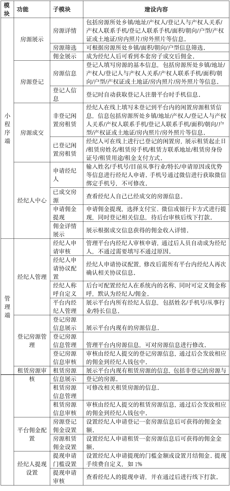
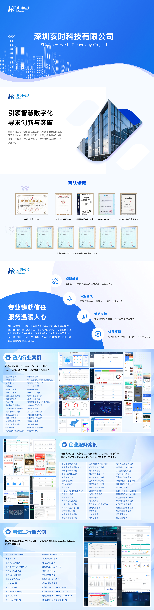

 

    
 

公司拥有上百套具有自主知识产权的软件系统，详情请查看码云首页或公司官网

 
<h1>房产全民经纪人系统</h1>

<a href="https://www.haishi.net.cn/">公司官网</a> ｜ <a href="https://www.haishi.net.cn/">在线体验</a>

 

## 系统介绍

房产信息登记、交易、咨询平台
房产信息登记、交易、咨询平台
本项目名称为全民经纪人，是一个连接经纪人和租客的房屋租赁平台。该平台提供房源发布、筛选、查看详情、经纪人申请、出租管理、成交管理、提现管理以及系统管理等功能，旨在提高房屋租赁效率，方便用户快速找到合适的房源或租客。
本项目从用户层面可以分为两个端：管理后台和小程序端。
- 管理后台：管理员用户使用，可以进行内容管理（轮播图、动态）、经纪人管理、出租管理、成交管理、提现管理、系统管理（菜单、佣金、区域、租赁用途等基础设置）等。
- 小程序端：用户使用，可以浏览房源、筛选房源、查看房源详情、申请成为经纪人、发布出租信息、管理我的出租、查看我的成交以及提现记录和佣金记录等。
                

## 系统功能介绍

### 系统包含终端说明

管理端（WEB）、用户端（微信小程序）

| 序号 | 模块 | 模块说明 |
| --- | --- | --- |
| 1 | FWY-QMJJR-FC-MP | 小程序 |
| 2 | FWY-QMJJR-FC-SERVER | 服务端 |

### 系统功能结构

### 系统功能说明

主要功能：
小程序端：
- 房源筛选：用户可以根据自己的需求筛选房源，例如：区域、价格、户型等。
- 查看房源详情：用户可以查看房源的详细信息，例如：图片、描述、联系方式等。
- 申请经纪人：用户可以申请成为经纪人，发布房源信息，赚取佣金。
- 发布出租：经纪人可以发布出租房源信息。
- 我的出租：经纪人可以管理自己发布的出租房源。
- 我的成交：经纪人可以查看自己的成交记录。
- 提现记录：经纪人可以查看自己的提现记录。
- 佣金记录：经纪人可以查看自己的佣金记录。
管理后台：
- 经纪人管理：管理员可以管理经纪人信息，例如：审核经纪人申请、设置经纪人权限等。
- 出租管理：管理员可以管理出租房源信息，例如：审核出租房源、下架出租房源等。
- 成交管理：管理员可以管理成交记录。
- 提现管理：管理员可以管理提现申请，例如：审核提现申请、处理提现等。
- 系统管理：管理员可以管理系统设置，例如：设置佣金比例、管理区域信息等。

## 系统主要界面

## 系统技术说明

### 代码模块说明

| 序号 | 目录 | 目录说明 |
| --- | --- | --- |
| 1 | FWY-QMJJR-FC-SERVER/database | -- |
| 2 | FWY-QMJJR-FC-SERVER/bootstrap | -- |
| 3 | FWY-QMJJR-FC-SERVER/app | -- |
| 4 | FWY-QMJJR-FC-SERVER/config | -- |
| 5 | FWY-QMJJR-FC-SERVER/resources | -- |
| 6 | FWY-QMJJR-FC-SERVER/tests | -- |
| 7 | FWY-QMJJR-FC-SERVER/storage | -- |
| 8 | FWY-QMJJR-FC-SERVER/lang | -- |
| 9 | FWY-QMJJR-FC-SERVER/public | -- |
| 10 | FWY-QMJJR-FC-SERVER/routes | -- |
| 11 | FWY-QMJJR-FC-SERVER/vendor | -- |

### 系统技术选型

#### 开发语言/框架

PHP
前端框架：VUE2

#### 服务中间件

Nginx

#### 数据库

MySQL（5.7+）

#### 其他说明

无

## 系统演示/商用

请扫码添加客服微信获取演示地址和系统详细资料。

如果您想基于房产全民经纪人系统进行商业化交付或定制开发服务，我们提供有偿的技术服务支持，合作模式不限，欢迎沟通！

公司官网地址： <a href="https://www.haishi.net.cn/">https://www.haishi.net.cn</a>

联系客服获取专业回答。

## 使用须知

1、 本项目商用必须获得版权所有者的授权。

2、 未经允许本项目代码不允许二次出售。

